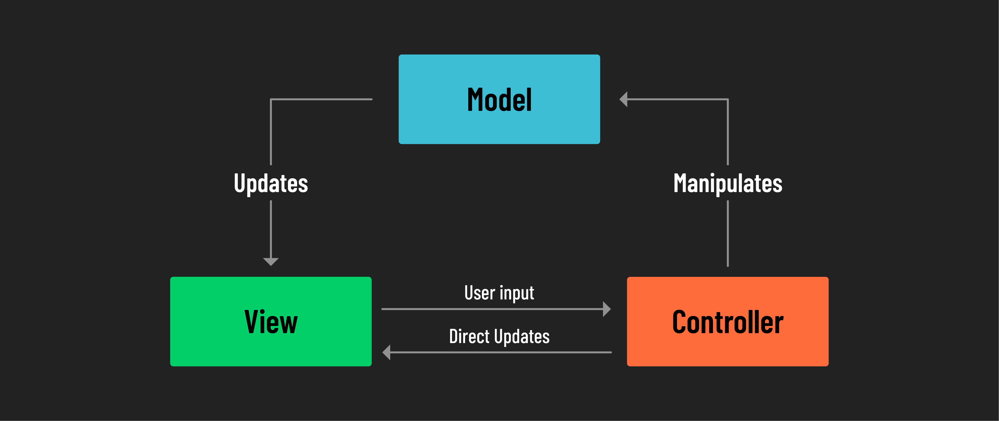

<h1>
  MVC Architecture in Python Applications
  What is the MVC Pattern?
</h1>

**Learning objective:** By the end of this lesson, you will be able to **describe** the MVC (Model-View-Controller) architecture, its purpose, and the roles of Model, View, and Controller in organizing an application.

## Understanding MVC architecture

When building web applications or APIs, keeping your code **organized and manageable** is essential. That’s where **MVC (Model-View-Controller)** comes in. It’s a **design pattern** that helps developers structure their code by dividing responsibilities into separate sections. This approach is often called the **separation of concerns**, and it makes our applications easier to understand, modify, and debug.

## Why MVC matters

Imagine you’re untangling a box of wires: when everything is jumbled together, it’s hard to figure out which wire does what. In coding, this happens when different parts of an application—like how we store data, display information, and handle user requests—are tightly woven together. It becomes confusing and time-consuming to make changes without breaking something.

MVC helps prevent this by **dividing the codebase into distinct roles**.

- **Models** handle data.
- **Views** handle presentation.
- **Controllers** handle logic and coordination.

This division allows each part to do its job without interfering with others, making it easier to maintain and expand the application.

## How MVC works

Here’s how MVC splits the responsibilities in a web application or API:

| **Component**  | **Role**                                                                                           |
| -------------- | -------------------------------------------------------------------------------------------------- |
| **Model**      | Manages the data, interfaces with the database, and ensures data is valid.                         |
| **View**       | Presents the data to the user (ex: in HTML for web apps or as JSON responses in APIs).             |
| **Controller** | Acts as a bridge: processes incoming requests, gets data from the model, and sends it to the view. |

## Routers and resources

In an MVC application, each resource (ex: "users" or "products") usually has its own set of models, views, and controllers. On top of these, **routers** handle incoming requests and decide which controller should process them.

For example:

- A request to `/users` might go to the `UserController`, which retrieves data using the `UserModel` and formats the response for the client.

Sticking to this design principle means that our code is easier to read, easier to understand, and easier to maintain.
